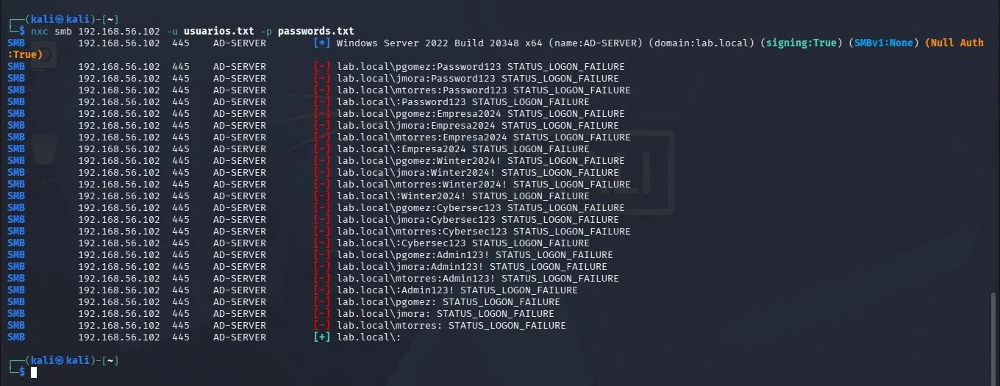
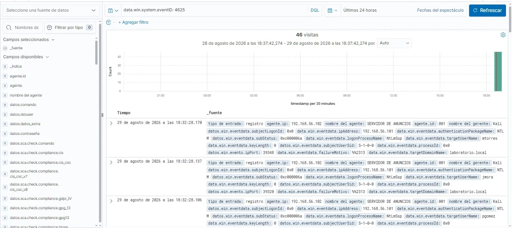
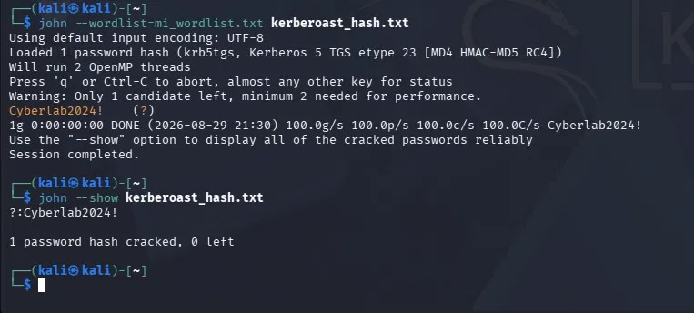
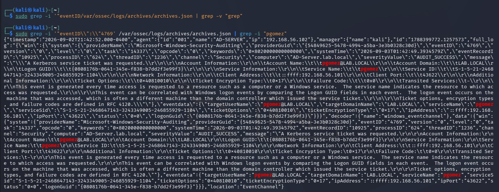

# Laboratorio de Ataques y Detección en Active Directory

**Autor:** Jorge Andrés Araya Chinchilla

**Fecha:** 3 de Septiembre 2026

**Entorno:** Lab aislado (VirtualBox — Host-only network)

### Resumen


Laboratorio casero de ciberseguridad (Home SOC) construido para simular un entorno corporativo de Active Directory a pequeña escala, ejecutando técnicas de ataque reales contra él, y validar su detección mediante un SIEM. Desarrollado como proyecto autodirigido para demostrar habilidades prácticas de seguridad sin experiencia profesional previa en el área.


### Arquitectura del Laboratorio

Todas las máquinas virtuales corren en VirtualBox, conectadas mediante una red Host-Only aislada de internet de la máquina anfitriona.

| Máquina | Rol | Dirección IP | Sistema Operativo |
|---|---|---|---|
| Kali Linux | Atacante + host del SIEM | 192.168.56.101 | Kali Rolling |
| AD-SERVER | Controlador de Dominio (`lab.local`) | 192.168.56.102 | Windows Server 2022 |
| AD-Victim-Win11 | Cliente unido al dominio | 192.168.56.103 | Windows 11 Enterprise |

**Dominio:** `lab.local` (NetBIOS: `LAB`)
**Usuarios de prueba:** `pgomez`, `jmora`, `mtorres` — organizados bajo una OU llamada `Empleados`

### Diagrama de Red

```
┌─────────────────┐        ┌──────────────────────┐        ┌─────────────────────┐
│   Kali Linux     │        │      AD-SERVER        │        │  AD-Victim-Win11     │
│ 192.168.56.101   │◄──────►│   192.168.56.102       │◄──────►│  192.168.56.103      │
│                  │        │  Controlador de       │        │  Cliente unido       │
│ - Herramientas   │        │  Dominio               │        │  al dominio          │
│   de ataque      │        │  lab.local             │        │  Agente Wazuh        │
│ - SIEM Wazuh     │        │  Agente Wazuh          │        │                      │
│   (indexer,      │        │                        │        │                      │
│   manager,       │        │                        │        │                      │
│   dashboard)     │        │                        │        │                      │
└─────────────────┘        └──────────────────────┘        └─────────────────────┘
      Red Host-Only: 192.168.56.0/24
```

### Herramientas

- **VirtualBox** — hipervisor para todas las máquinas del laboratorio
- **Wazuh** — SIEM de código abierto (indexer, manager, dashboard, agentes); elegido sobre Splunk para mejorar habilidades en diferentes SIEM
- **NetExec (nxc)** — pruebas de autenticación SMB / password spraying
- **Impacket (`GetUserSPNs`)** — Kerberoasting, extracción de TGS
- **John the Ripper** — cracking de hashes offline
- **PowerShell / módulo de Active Directory** — configuración del dominio y de cuentas

### Fases de Construcción

1. **Configuración del entorno** — red host-only en VirtualBox, instalación de VMs base
2. **Configuración de Active Directory** — promoción del Controlador de Dominio, creación de OU y usuarios
3. **Herramientas de detección** — despliegue del SIEM Wazuh y sus agentes
4. **Simulación de ataques** — ejecución de técnicas de ataque reales contra el dominio
5. **Documentación** — este reporte

---

## Ataque 1: Fuerza Bruta / Password Spraying

### Objetivo
Simular a un atacante externo o interno que intenta obtener acceso inicial adivinando contraseñas débiles o comunes contra cuentas conocidas del dominio.

### Ejecución

Desde Kali, contra el servicio SMB del Controlador de Dominio:

```bash
nxc smb 192.168.56.102 -u usuarios.txt -p passwords.txt
```

- **Usuarios probados:** `pgomez`, `jmora`, `mtorres`
- **Lista de contraseñas:** una lista pequeña personalizada de contraseñas comunes y débiles ( `Password123`, `Winter2024!`)

### Resultado

Todos los intentos de autenticación fallaron como se esperaba (`STATUS_LOGON_FAILURE`), confirmando que las cuentas no usaban ninguna de las contraseñas probadas — un resultado válido y realista para un entorno de prueba correctamente asegurado.

### Detección en Wazuh

Al filtrar el módulo **Discover** de Wazuh por el Event ID de Windows `4625` (Fallo de inicio de sesión de una cuenta), aparecieron **46 eventos coincidentes**, cada uno mostrando:

- IP de origen: `192.168.56.101` (el atacante / Kali)
- Usuarios objetivo coincidiendo con la lista de ataque (`pgomez`, `jmora`, `mtorres`)
- Paquete de autenticación: `NTLM`
- Todos los eventos concentrados exactamente en el rango de tiempo del ataque

Esto confirma que los intentos de autenticación fallidos contra el Controlador de Dominio son visibles casi en tiempo real mediante el agente de Wazuh desplegado y la auditoría de seguridad por defecto de Windows.

***Evidencia:***




---

### Ataque 2: Kerberoasting

### Objetivo
Simular un escenario post-explotación: un atacante con credenciales válidas de bajo privilegio abusa de Kerberos para extraer el hash de contraseña de una cuenta de servicio y crackearlo offline — una técnica muy común en entornos reales de Active Directory que usan indebidamente cuentas de usuario normales como cuentas de servicio.

### Configuración

Para crear una cuenta "roasteable" realista, se configuró la cuenta `pgomez` con:

```powershell
Set-ADAccountPassword -Identity pgomez -Reset -NewPassword (ConvertTo-SecureString -AsPlainText "Cyberlab2024!" -Force)
Set-ADUser -Identity pgomez -ChangePasswordAtLogon $false
setspn -A HTTP/pgomez-service.lab.local pgomez
```

Esto simula el error de configuración común en el mundo real donde una cuenta de usuario estándar también se usa como cuenta de servicio (tiene un SPN registrado), convirtiéndola en un objetivo de Kerberoasting.

### Ejecución

Desde Kali, usando credenciales conocidas de `pgomez`:

```bash
impacket-GetUserSPNs lab.local/pgomez:'Cyberlab2024!' -dc-ip 192.168.56.102 -request
```

Esto enumeró todos los SPNs del dominio y solicitó un ticket de servicio Kerberos (TGS) para el SPN `HTTP/pgomez-service.lab.local`, devolviendo el ticket como un hash crackeable (`$krb5tgs$23$...`).

### Cracking

```bash
john --wordlist=mi_wordlist.txt kerberoast_hash.txt
john --show kerberoast_hash.txt
```

**Resultado:** `1 password hash cracked, 0 left` — la contraseña en texto plano `Cyberlab2024!` fue recuperada exitosamente de forma offline.

### Reto de Detección y Solución

Inicialmente, no se pudo encontrar el Event ID `4769` correspondiente de Windows (Solicitud de ticket de servicio Kerberos) para el ataque, a pesar de que Wazuh capturaba normalmente otros eventos de Seguridad de Windows. El análisis de causa raíz reveló dos brechas:

1. **Brecha en la política de auditoría por defecto:** Windows Server no audita las operaciones de tickets de servicio Kerberos por defecto. Solucionado con:
   ```powershell
   auditpol /set /subcategory:"Kerberos Service Ticket Operations" /success:enable /failure:enable
   ```
2. **Sobrescritura por política de auditoría legacy:** incluso después de habilitar la subcategoría, la política de auditoría avanzada era ignorada silenciosamente porque faltaba la clave de registro que fuerza su precedencia sobre la política legacy:
   ```powershell
   reg add "HKLM\SYSTEM\CurrentControlSet\Control\Lsa" /v SCENoApplyLegacyAuditPolicy /t REG_DWORD /d 1 /f
   ```
3. **Registro de archivo (archive) en Wazuh:** Por defecto, Wazuh solo almacena eventos que coinciden con una regla de alerta, descartando todo lo demás. Para conservar y buscar en el flujo completo de eventos crudos, se habilitó el registro completo en `/var/ossec/etc/ossec.conf`:
   ```xml
   <logall>yes</logall>
   <logall_json>yes</logall_json>
   ```

Después de aplicar ambas soluciones y volver a ejecutar el ataque, el evento correspondiente se encontró directamente en el archivo de registro crudo de Wazuh (`/var/ossec/logs/archives/archives.json`):

```json
{
  "eventID": "4769",
  "targetUserName": "pgomez@LAB.LOCAL",
  "serviceName": "pgomez",
  "ipAddress": "::ffff:192.168.56.101",
  "ticketEncryptionType": "0x17",
  "ticketOptions": "0x40810010"
}
```

El indicador clave de actividad de ataque es **`ticketEncryptionType: 0x17` (RC4)** — los tickets Kerberos legítimos y modernos típicamente negocian AES (`0x12`), mientras que herramientas de ataque como Impacket comúnmente fuerzan el cifrado RC4, más débil, al solicitar tickets de servicio. Este único campo es uno de los indicadores más confiables y de bajo ruido para detectar actividad de Kerberoasting en un entorno de AD.

**Evidencia:** 



---

## Hallazgos y Lecciones Aprendidas Clave

- **El password spraying es fácil de detectar desde el primer momento.** La auditoría de seguridad por defecto de Windows, combinada con un agente de Wazuh correctamente configurado, es suficiente para identificar actividad de fuerza bruta sin necesidad de ajustes adicionales.
- **El Kerberoasting requiere configuración deliberada de la política de auditoría.** Por defecto, Windows Server no registra las solicitudes de tickets de servicio Kerberos con suficiente detalle para detectar este ataque — un error de configuración real que muchas organizaciones pueden pasar por alto.
- **La Política de Auditoría Avanzada puede ser sobrescrita silenciosamente por la Política de Auditoría Legacy.** La clave de registro `SCENoApplyLegacyAuditPolicy` debe configurarse explícitamente para que las subcategorías de auditoría granular tengan efecto — un problema sutil pero común en el endurecimiento (hardening) de Windows.
- **Las reglas de alerta del SIEM no son lo mismo que la retención de logs crudos.** Wazuh descarta eventos que no coinciden con una regla a menos que se habilite explícitamente el registro completo (`logall`) — una distinción importante para construir detección integral y posteriormente escribir reglas de correlación personalizadas.
- **Detección de Kerberoasting.** el cifrado RC4 (0x17) en el Event ID 4769 es un indicador fuerte y de bajo ruido.


## Habilidades Demostradas

- Despliegue y configuración de Active Directory (Controlador de Dominio, OUs, usuarios, SPNs)
- Despliegue y administración de SIEM (Wazuh: instalación multi-componente, gestión de agentes, resolución de problemas)
- Ejecución de técnicas ofensivas: password spraying (NetExec), Kerberoasting (Impacket)
- Cracking de contraseñas offline (John the Ripper)
- Auditoría de seguridad de Windows y configuración de políticas de grupo / auditoría
- Análisis de logs y correlación de evidencia usando datos crudos de archivo del SIEM
- Resolución de problemas de causa raíz en brechas de detección
